# 유사 원피스 검색: SigLIP2 Fine-tuning 실험 리포트

**목표**: "유사 상품"을 직접 정의하고, 그 정의에 따라 SigLIP2의 image-to-image 검색 품질을 개선할 수 있는지 확인한다. 개선된 SigLIP2를 fine-tuning 하지 않은 SigLIP2, 그리고 상용 모델 Tianmu-MERE와 비교해 어떤 상황에서 더 잘하고 어떤 상황에서 못하는지 근거를 들어 설명한다.

**미리 요약**: fine-tuning은 정량 지표(Recall@20)를 baseline 대비 크게 개선했지만, 개선은 학습 초반(약 600 step)에서 정점을 찍은 뒤 학습이 계속되면서 오히려 나빠진다. 이 실패 양상(뒤에서 "collapse"라고 부름)은 검색 결과의 상위권이 서로 거의 구분되지 않게 되는 현상으로, recall 수치만 봐서는 드러나지 않고 임베딩을 직접 들여다봐야 보인다. 이 리포트는 그 과정과 근거를 순서대로 담았다.

---

## (1) 유사 상품 정의 및 평가 체계

### 유사성의 정의: 실루엣 IoU

이번 프로젝트에서 "유사한 원피스"는 **실루엣(옷의 외곽선)이 겹치는 정도**로 정의한다. 구체적으로는 원피스 영역만 남긴 흑백 마스크 두 장을 같은 크기로 맞춘 뒤, IoU(Intersection over Union, 두 마스크가 겹치는 면적을 두 마스크를 합친 면적으로 나눈 값 — 1에 가까울수록 모양이 똑같고 0에 가까울수록 다름)를 계산한다.

이렇게 정의하면 절대적인 크기나 사진 속 위치는 자동으로 제거되고, 소매 모양이나 기장 비율처럼 외곽선에 드러나는 특징은 자연스럽게 반영된다. 반대로 패턴·색상·넥라인처럼 마스크에 담기지 않는 디테일은 이 정의에서 제외된다 — 이는 "실루엣만 본다"는 의도적인 범위 설정이자 한계다.

파이프라인:

1. Grounded-SAM(Grounding DINO + SAM)으로 원피스 영역 마스크를 뽑는다.
2. 마스크를 정사각형으로 자르고 64×64로 줄인 "canonical mask"를 만든다 — 크기·위치 차이를 없애기 위함이다.
3. 이렇게 나온 모든 이미지 쌍의 IoU를 계산한다.

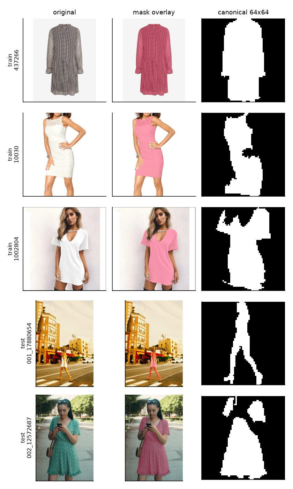
*원본 → 마스크 오버레이 → canonical 64×64 마스크. train 3장, test 3장 예시. test는 사람이 거리에서 찍힌 거리 샷이 많아 원본 그대로 작게 넣으면 마스크 품질이 떨어져서, Grounding DINO가 찾은 박스를 원본 해상도로 크롭한 뒤 SAM에 넣는 2단계 처리를 사용했다.*

### Positive pair: 서로 다른 상품인데 실루엣이 비슷한 쌍

같은 상품의 다른 사진이 아니라, **서로 다른 상품인데 실루엣이 실제로 비슷한 이미지 쌍**을 모델 학습의 "정답"(positive pair)으로 쓴다. 평가 대상 모델(SigLIP2, Tianmu-MERE)의 임베딩으로 유사도를 정의하지 않는 것도 이 때문이다 — 그렇게 하면 "모델이 비슷하다고 한 것이 곧 정답"이 되는 순환논리에 빠진다.

IoU 문턱값(threshold)은 사람 라벨(gold set)이 없어 점수대별 샘플을 눈으로 직접 비교해 정했다.

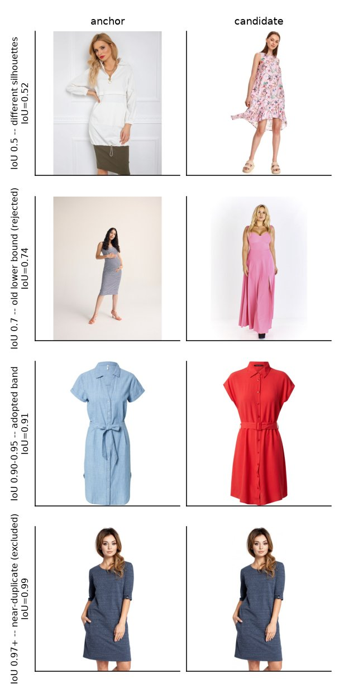
*IoU 점수대별 실제 쌍 예시. 0.7 근처는 얼핏 비슷해 보여도 기장·핏이 다른 경우가 섞여 있었고, 0.90~0.95 구간에서 "명백히 다른 상품인데 실루엣은 사실상 같다"는 가장 좋은 품질의 쌍이 나왔다. 0.97 이상은 사실상 동일한 사진(near-duplicate)이라 제외했다.*

최종적으로 **IoU 0.90~0.95** 구간만 positive pair로 채택했다. 대신 이 구간을 만족하는 anchor(기준 이미지) 수가 크게 줄어들어(2,000장 기준 1,906개→538개), 학습에 쓰는 train 이미지를 2,000장에서 4,000장으로 늘려 anchor 수를 1,128개까지 보충했다.

### 4가지 질문에 대한 답

- **유사성 판단의 주관성 관리**: 유사도 자체는 IoU라는 기하학적 계산으로 고정해 주관을 배제했다. 다만 "어느 IoU부터 같은 상품으로 볼 것인가"라는 threshold 선택은 육안 스팟체크로 결정했으므로, 이 부분에는 여전히 사람의 판단이 들어간다 — 이는 리포트 (4)의 한계에서 다시 다룬다.
- **학습 데이터와 평가 쿼리의 분리**: test 100장(`data/raw/images-800px-test/`)은 물리적으로 별도 폴더에 보관하고 학습·pair 마이닝 어디에도 사용하지 않았다. train 내부에는 정식 validation split을 두지 않는 대신, 고정된 쿼리 샘플로 학습 중 검색 결과를 계속 관찰했다(자세한 방식은 (3) 참고).
- **중복 이미지·동일 상품으로 인한 데이터 누수 방지**: 상품명(`name`) 문자열이 완전히 같은 이미지 그룹(1,407그룹, 4,153장)과, IoU가 0.97을 넘는 near-duplicate 쌍을 positive pair 후보에서 제외했다.
- **외부 쿼리(test 100장)에서의 검색 품질**: (4)에서 세 모델 모두에 test 이미지를 쿼리로 넣어 정성적으로 확인한다.

---

## (2) 베이스라인 분석 및 개선 가설

### 지표: shape Recall@20

fine-tuning 전 SigLIP2·Tianmu-MERE가 이 실루엣 정의를 얼마나 잡아내는지부터 측정했다. 지표는 **shape Recall@20**: 어떤 이미지를 쿼리로 코사인 유사도(cosine similarity, 두 임베딩 벡터의 방향이 얼마나 같은지를 -1~1로 나타낸 값 — 1이면 방향이 완전히 같고 0이면 무관함) 상위 20장을 뽑았을 때, 그중 실제 IoU 0.90~0.95 positive pair가 몇 개나 들어있는지의 비율이다. 무작위로 20장을 뽑았을 때 기대되는 recall(코퍼스 크기에서 20을 나눈 값, 0.005)을 함께 표시해 비교 기준으로 삼는다.

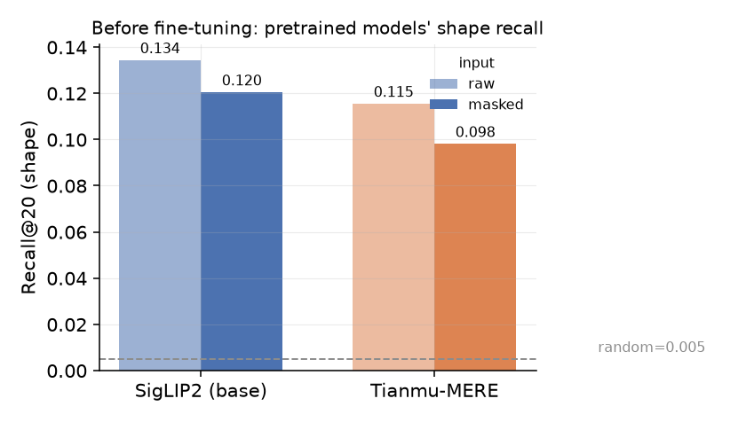

- SigLIP2(masked): 0.120, Tianmu-MERE(masked): 0.098 — 무작위 대비 각각 **24배, 20배**.
- 즉 두 모델 모두 "완전히 실루엣을 못 본다"는 아니고, **약한 신호가 이미 있다**. 다만 이 정도로는 실무에서 쓸 만한 수준이 아니다.

### 성공·실패 사례

`figures/04_final/improved_case.jpg`의 "SigLIP2 (base)" 구역(아래 (4)에서 다시 전체를 보여줌)을 보면, 그래픽 티셔츠 원피스 쿼리에 대해 같은 그래픽/텍스트 프린트 원피스들을 상위로 가져온다 — 실루엣보다 패턴에 더 반응하는 경향이 보인다. 반대로 마스크 처리된 입력에서는 배경·색상 정보가 없어지므로 실루엣 신호가 상대적으로 더 부각된다.

### 개선 가설

패턴/색상 같은 실루엣 외 신호에 쏠리는 pretrained representation을, **"서로 다른 상품이지만 실루엣이 비슷한 쌍은 가깝게, 나머지는 멀게"** 라는 목적함수로 추가 학습시키면 shape recall이 오를 것이라는 가설을 세웠다. 모든 개선 방향을 다 검증하기보다, self-supervised 방식 중 실루엣처럼 "라벨 없는 기하학적 유사성"을 학습시키는 데 적합한 self-distillation(DINO 계열) 한 가지에 집중했다.

---

## (3) SigLIP2 Fine-tuning

### 학습 데이터·전처리

- GLAMI-1M dresses 26,326장 중 무작위 4,000장 사용(시간 예산상 baseline 규모로 제한).
- 입력은 **masked global view**: 마스크 bbox로 크롭한 뒤 마스크 밖(배경)을 0으로 채운다 — "배경이 같아서 유사하다"는 shortcut을 막기 위함이다.
- **boundary-anchored local crop**: 실루엣 경계 픽셀 위에 crop 중심을 두어, 옷과 배경을 동시에 담는 국소 crop 4장을 추가로 사용한다.

### 학습 방식: prototype-matching self-distillation

DINO 방식의 self-distillation을 사용했다. 핵심 아이디어: 학생(student) 네트워크가 여러 개의 다른 시점(view)에서 같은 대상을 보고도 선생(teacher, 학생의 가중치를 지수이동평균으로 따라가는 네트워크)이 내놓은 답과 같은 답을 내도록 학습시킨다. 여기서 "답"은 K=1024개의 학습 가능한 prototype(원형 벡터) 중 어디에 가까운지를 나타내는 확률 분포다.

- Teacher는 anchor(기준 이미지)의 global view 1장만 보고, student는 mined positive(실루엣이 비슷한 다른 상품)의 global view 1장 + local crop 4장, 총 5장을 본다 — teacher와 완전히 같은 이미지(anchor 자체)는 student에게 주지 않는다. 이렇게 해야 "서로 다른 상품인데 실루엣이 비슷하다"는 신호로만 학습되고, "같은 사진의 색조 차이만 구분하면 된다"는 쉬운 지름길을 막을 수 있다.
- Backbone(SigLIP2 vision encoder)은 전부 freeze하고, attention의 Q/V projection에만 LoRA adapter(r=16)를 붙여 학습한다. Backbone 위에 새로 얹은 prototype head(MLP + weight-normalized linear, 256차원 bottleneck)도 함께 학습한다.
- Collapse(모든 이미지가 비슷한 답으로 쏠리는 현상 — 아래에서 실제로 이 문제가 발생한다) 방지를 위해 DINO 표준 기법인 centering(teacher 출력의 평균을 빼는 것)과 sharpening(teacher는 낮은 temperature로 날카롭게, student는 높은 temperature로 부드럽게)을 사용했다.

### 관찰 → 결정 기록

- **입력 정규화 버그**: SigLIP2 pretrained 가중치는 [-1,1] 범위 입력을 전제로 학습되어 있는데, 초기 view 파이프라인은 [0,1] 범위를 그대로 넘기고 있었다. Backbone이 거의 다 freeze된 상태라 이 버그가 있으면 LoRA만으로는 보정이 안 될 정도로 치명적이라, 실제 학습 직전에 발견해 수정했다(`backbone.py`, `pixel_values*2-1`).
- **IoU threshold 재조정**: 처음엔 하한 0.70으로 시작했으나 스팟체크 결과 0.70대는 기장·핏이 다른 쌍이 섞여 있어 0.90~0.95로 좁혔다. 그 대신 커버리지가 줄어(위 (1) 참고) train 이미지를 2배로 늘려 보완했다.

### 학습 곡선과 collapse

L40S 1장에서 1시간 예산으로 3,000 step을 목표했으나 실제로는 2,600여 step에서 종료됐다(300 step마다 체크포인트 저장, 마지막 저장분은 step 2400).

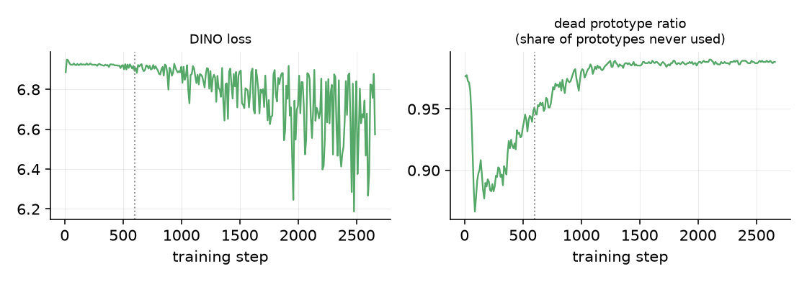

오른쪽 그래프의 **dead prototype ratio**는, K=1024개 prototype 중 최근 학습 배치들에서 한 번도 "가장 높은 확률을 받은 prototype"(argmax)으로 뽑히지 않은 것의 비율이다 — 값이 1에 가까울수록 소수의 prototype에만 모든 이미지가 몰리고 있다는 뜻이다. 학습 초반부터 이미 0.87~0.99로 매우 높고, 학습이 진행될수록 더 올라간다. 즉 1024개 prototype 중 실제로 쓰이는 건 학습 후반에는 수십 개뿐이다.

이 신호가 검색 품질에 실제로 어떤 영향을 주는지 확인하기 위해, 저장된 8개 체크포인트 전부에서 train 코퍼스(4,000장) 임베딩을 뽑아 두 가지를 같이 쟀다: shape Recall@20, 그리고 "쿼리 하나당 코사인 유사도 0.999 이상인 다른 이미지가 평균 몇 개나 있는가"(near-duplicate neighbor 수 — 모델이 사실상 "같은 사진"이라고 판단한, 실제로는 다른 상품인 이미지의 개수라고 이해하면 된다).

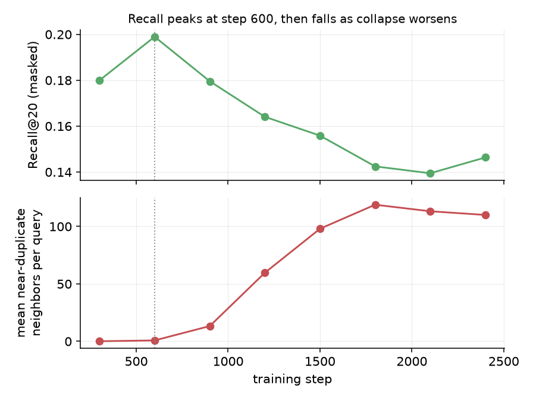

두 곡선이 **정확히 반대 방향**으로 움직인다: recall은 step 600에서 정점(0.199)을 찍고 이후 계속 떨어지고, near-duplicate 이웃 수는 step 600까지는 거의 0이다가 이후 계속 늘어나 100개를 넘는다. 즉 학습을 더 시킬수록 검색 순위 안에 "실제로는 다른 상품인데 모델이 구분 못 하는" 이미지가 점점 더 많이 섞여 들어오고, 그만큼 진짜 positive를 밀어내면서 recall이 나빠진다.

같은 쿼리(원피스 437266)를 step별로 직접 비교해도 같은 흐름이 보인다.

| step 300 | step 600 (채택) | step 2400 (최종) |
|---|---|---|
| 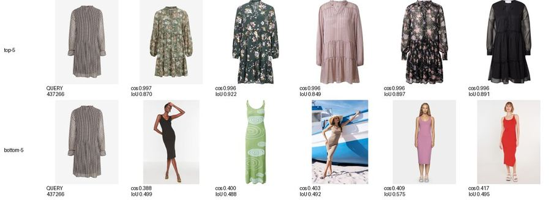 | 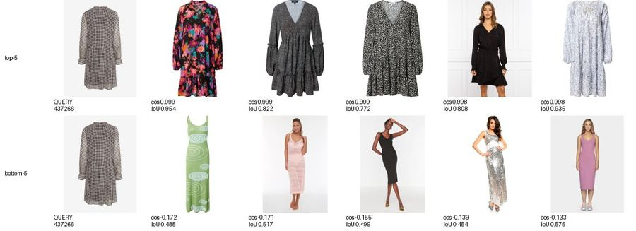 | 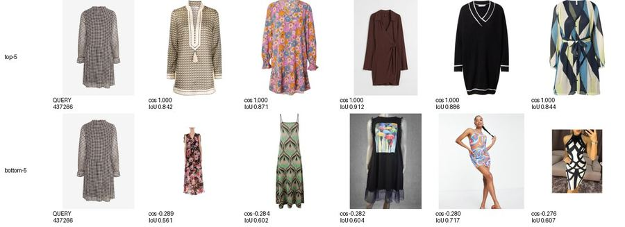 |

top-5의 cosine 값이 step 300 "0.997→0.996"(작지만 순위 차이가 있음) → step 600 "0.999→0.998" → step 2400 "전부 1.000"으로 점점 평평해진다. step 2400에서는 top-5 다섯 장이 코사인 값으로 전혀 구분되지 않는다 — 상위 순위 자체가 의미를 잃는다는 뜻이다.

**왜 학습 로그의 entropy 지표는 이걸 잡아내지 못했나.** entropy(엔트로피, 확률 분포가 얼마나 "퍼져있는지"를 나타내는 값 — 모든 prototype에 확률이 고르게 퍼져 있으면 최댓값, 하나에 몰려 있으면 0에 가까움)를 학습 내내 로깅했는데, 값이 시작부터 끝까지 최댓값(ln(1024)≈6.93) 근처에서 거의 변하지 않았다. 원인은 이 entropy가 **student의 확률 분포**(student_temp=0.1)로 계산됐기 때문이다 — teacher(temp 0.04~0.07)보다 일부러 완만하게 설정된 값이라 원래도 entropy가 높게 나오도록 되어 있어서, prototype이 소수에 쏠리는 문제와는 별개로 항상 높은 값을 보인다. 반면 같이 로깅된 dead prototype ratio(여러 step에 걸친 실제 사용 이력 기반)는 이 문제를 처음부터 정확히 보여주고 있었다 — **로깅은 됐지만 학습 중 이 신호를 기준으로 조기 종료하는 절차가 없었다**는 것이 이번 실행의 운영상 허점이다.

### 결정: 최종 체크포인트가 아니라 step 600을 채택

위 근거로, (4)의 최종 비교에서 "fine-tuned SigLIP2"는 학습이 끝난 마지막 체크포인트(step 2400)가 아니라 **recall이 가장 높고 collapse가 아직 거의 시작되지 않은 step 600 체크포인트**를 사용한다.

---

## (4) 최종 검증 및 결과 해석

동일한 train 코퍼스(4,000장, shape Recall@20)와 test 100장(정성 확인)을 기준으로 세 모델을 비교한다: 사전학습 SigLIP2, fine-tuning한 SigLIP2(step 600), Tianmu-MERE.

### 정량 비교: masking 효과와 SFT 효과 분리

입력을 raw(원본)와 masked(배경 제거) 두 조건으로 나눠 3개 모델 모두 측정해, "masking만으로 좋아지는 부분"과 "masking 위에 fine-tuning을 더해서 좋아지는 부분"을 구분했다.

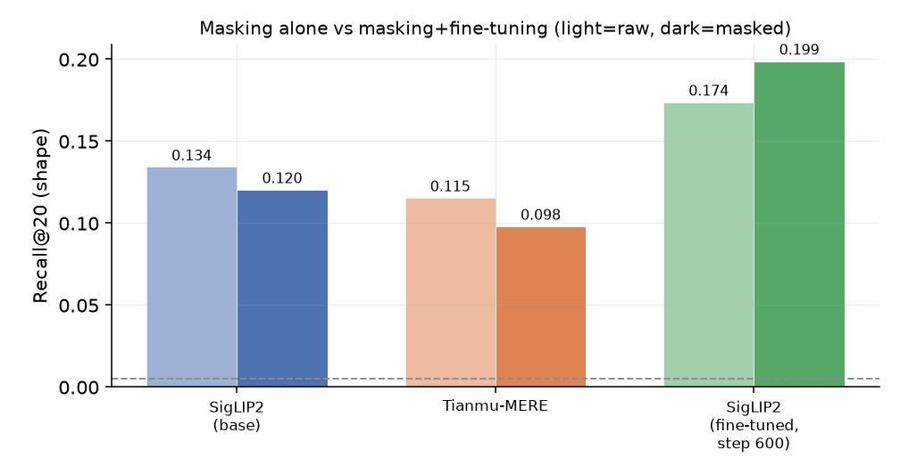

| 모델 | raw | masked |
|---|---|---|
| SigLIP2 (base) | 0.134 | 0.120 |
| Tianmu-MERE | 0.115 | 0.098 |
| SigLIP2 (fine-tuned, step 600) | 0.174 | **0.199** |

흥미로운 점은 **masking 단독으로는 오히려 recall이 떨어진다**는 것이다(SigLIP2 0.134→0.120, Tianmu-MERE 0.115→0.098) — 두 pretrained 모델 모두 배경 맥락(예: 스튜디오 배경, 촬영 스타일)을 어느 정도 단서로 쓰고 있었다는 뜻이다. 반면 fine-tuned 모델은 masked 입력에서 가장 좋은 성능(0.199)을 낸다 — 학습 자체를 masked 입력으로만 진행했으니 당연한 결과지만, 동시에 **raw 입력에서도 baseline보다 훨씬 높다(0.174)**는 점에서 실루엣 정보 자체를 더 잘 잡아내게 됐다고 볼 수 있다.

### 전체 쌍 cosine 분포: "평균은 정상, 상위권은 비정상"

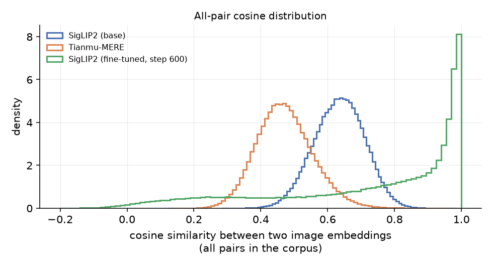

코퍼스 안 모든 이미지 쌍의 cosine similarity 분포를 보면, fine-tuned 모델의 전체적인 모양은 baseline들과 크게 다르지 않다(평균 0.43 근처로 오히려 baseline보다 낮음) — 극단적으로 말하면 "임베딩 공간 전체가 한 점으로 붕괴"하지는 않았다. 다만 오른쪽 끝(1.0 근처)에 뾰족한 봉우리가 있다 — 이게 바로 (3)에서 본 "일부 이미지들이 서로 거의 완전히 겹쳐버리는" 현상이다.

수치로 보면: 코퍼스 3,999장 중 쿼리의 88.7%가 top-1 이웃과 cosine 0.999 이상이고, 쿼리 하나당 평균 110개의 "near-duplicate 이웃"(위에서 정의한 대로, 실제로는 다른 상품인데 모델이 사실상 같다고 보는 이미지)을 갖는다. top-10 안에서 가장 비슷한 것과 가장 덜 비슷한 것의 cosine 차이(spread)는 평균 0.0016으로 사실상 0에 가깝다 — 즉 **상위 10개 사이의 순서는 거의 의미가 없다.** (이 수치들은 step 2400, collapse가 가장 심한 체크포인트 기준이며, 채택한 step 600은 이보다 훨씬 양호하다 — near-duplicate 이웃 평균 0.7개.)

### 주요 쿼리 Top-10 비교

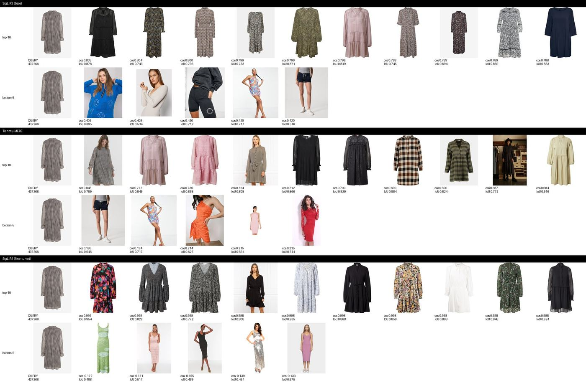

체크무늬 셔츠 원피스 쿼리에서, base SigLIP2와 Tianmu-MERE의 top-10은 비슷한 패턴(체크무늬, 스트라이프)에 더 반응하는 경향이 있다. fine-tuned 모델의 top-10은 패턴은 다양하지만 (셔츠형, 티어드, 롱슬리브 등) 실루엣 IoU가 0.77~0.95로 base보다 안정적으로 높다 — 다만 cosine 값 자체는 0.998~0.999로 거의 붙어 있어, "정말 이 순서가 맞는가"는 IoU 수치로 다시 확인해야 신뢰할 수 있는 상태다.

### 개선된 사례와 악화된 사례

anchor별로 (fine-tuned − base SigLIP2)의 Recall@20 차이가 가장 큰/작은 쿼리를 뽑았다.

**개선 사례** (그래픽 티셔츠 원피스 쿼리):
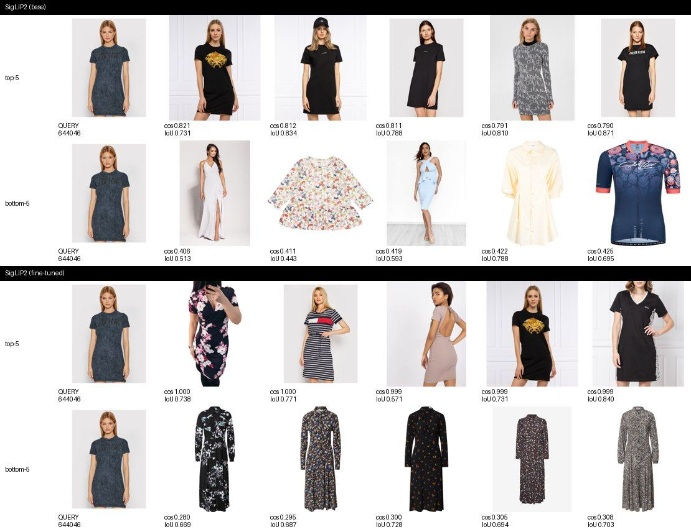
base는 같은 그래픽/텍스트 프린트에 반응해 실루엣이 다른 원피스(맥시, 슬립 드레스 등)까지 끌고 오지만, fine-tuned는 비슷한 fitted 티셔츠 원피스 실루엣으로 더 잘 모인다.

**악화 사례** (플로우가 있는 맥시 원피스 쿼리):
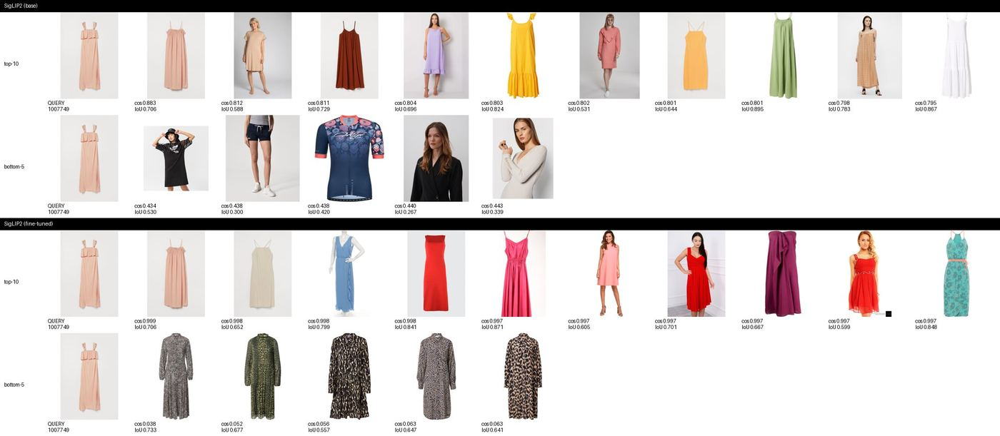
base는 다른 맥시/루즈핏 원피스를 IoU 0.7~0.89로 잘 찾는데, fine-tuned는 cosine은 0.997~0.999로 매우 높으면서도 실제로는 짧고 fitted한 원피스들을 상위로 올린다 — (3)에서 본 collapse의 부작용이 구체적으로 드러난 예시다. 이 쿼리의 실루엣(루즈핏 맥시)이 학습 후반 두 개의 거대 클러스터 중 소수쪽에 속했을 가능성이 있다.

### Test 100장: cross-domain 정성 확인

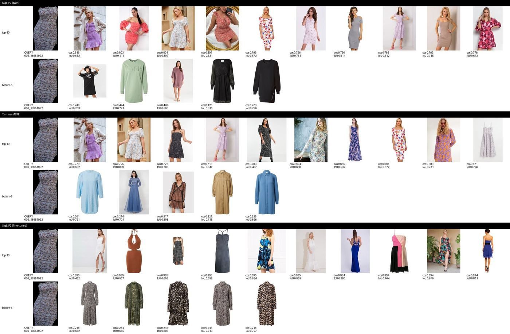

거리에서 찍힌 실제 착장 사진을 쿼리로 train 카탈로그를 검색한 예시. base·Tianmu-MERE·fine-tuned 모두 스트랩/슬리브리스 계열 원피스를 상위로 가져와, 마스크 추출이 정상 동작하는 test 이미지에서는 세 모델 모두 대체로 합리적인 실루엣 반응을 보인다. train과 촬영 환경(스튜디오 vs 거리)이 크게 다른데도 fine-tuned 모델이 특별히 더 무너지는 징후는 보이지 않았다.

### 결론: SigLIP2 검색 품질은 개선되었는가

**정량적으로는 그렇다** — masked Recall@20이 0.120→0.199로, 무작위 대비 40배 수준까지 올랐고, raw 입력에서도 baseline을 앞선다. Tianmu-MERE보다도 모든 조건에서 높다. 하지만 이 개선은 **"학습을 계속할수록 좋아진다"는 단순한 그림이 아니다.** 정점을 지나면 근본적으로 다른 실패 양상(collapse)이 시작되고, 그 실패는 recall 수치 하나만 보면 서서히 나빠지는 것처럼만 보이지만 실제로는 상위 검색 결과의 순위 자체가 무의미해지는 훨씬 심각한 문제다.

**한계와 다음 가설**:

1. **채택한 step 600도 완전히 안전하지는 않다.** near-duplicate 이웃이 평균 0.7개로 적지만 0은 아니며, 더 촘촘한 체크포인트 저장(예: 100 step 간격)으로 진짜 최적점이 600 근처의 다른 지점일 가능성을 배제하지 못했다.
2. **다음 실험 가설**: collapse의 근본 원인(K=1024 prototype 대비 batch size 8이 너무 작아 각 step에서 커버되는 prototype 수가 제한적이었을 가능성, 또는 teacher temperature warm-up이 너무 빨랐을 가능성)을 하나씩 눌러본 뒤, dead prototype ratio를 학습 중 조기 종료(early stopping) 기준으로 삼아 더 오래 학습해도 recall이 step 600을 넘어설 수 있는지 확인해야 한다.
3. 정식 train/val split이 없어 recall 수치를 고정 쿼리·train 코퍼스 자기 자신으로 측정했다 — 별도 held-out 상품군에 대한 일반화는 확인되지 않았다.
4. IoU 기반 실루엣 정의는 회전(rotation)을 정규화하지 않는다 — 제품 사진이 대체로 정면·직립이라는 전제가 깨지는 경우(회전된 착장 등)는 다루지 않았다.
5. 실루엣 정의상 패턴·색상·넥라인 등은 애초에 유사도 판단에서 제외된다 — "실루엣은 같지만 패턴이 완전히 다른" 두 원피스를 이 시스템은 계속 유사하다고 볼 것이다. 이는 설계상의 범위이지 버그는 아니지만, 실사용 맥락에서는 패턴 축을 추가로 고려해야 할 수 있다.
