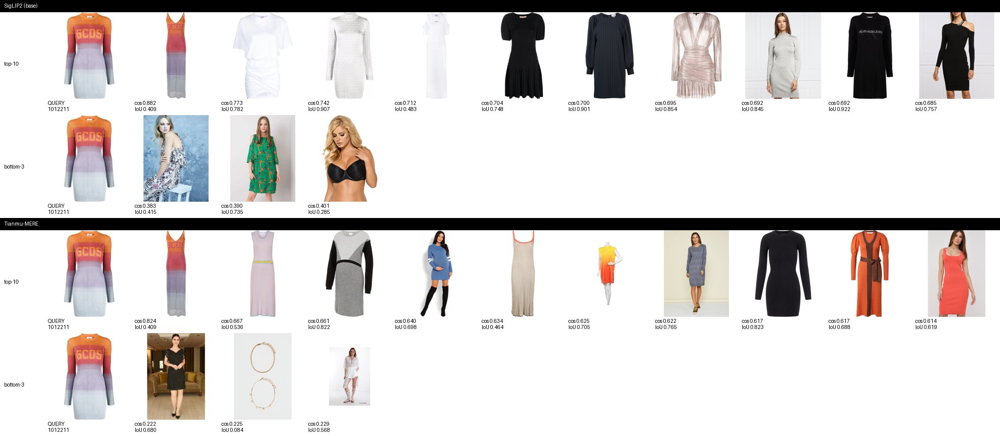
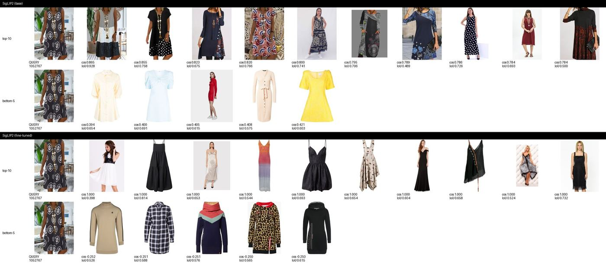

# 유사 원피스 검색: SigLIP2 Fine-tuning 실험 리포트

**목표**: "유사 상품"을 직접 정의하고, 그 정의에 따라 SigLIP2의 image-to-image 검색 품질을 개선할 수 있는지 확인한다. 개선된 SigLIP2를 fine-tuning 하지 않은 SigLIP2, 그리고 상용 모델 Tianmu-MERE와 비교해 어떤 상황에서 더 잘하고 어떤 상황에서 못하는지 근거를 들어 설명한다.

**TL;DR**: fine-tuning은 정량 지표(Recall@20)를 baseline 대비 크게 개선했지만, 개선은 학습 초반(약 600 step)에서 정점을 찍은 뒤 학습이 계속되면서 오히려 나빠진다. 이 실패 양상(뒤에서 "collapse"라고 부름)은 검색 결과의 상위권이 서로 거의 구분되지 않게 되는 현상으로, recall 수치만 봐서는 드러나지 않고 임베딩을 직접 들여다봐야 보인다. 이 리포트는 그 과정과 근거를 순서대로 담았다.

---

## (1) 유사 상품 정의 및 평가 체계

### 유사성의 정의: 실루엣 IoU

이번 프로젝트에서 "유사한 원피스"는 **실루엣(옷의 외곽선)이 겹치는 정도**로 정의한다. 구체적으로는 원피스 영역만 남긴 흑백 마스크 두 장을 같은 크기로 맞춘 뒤, IoU(Intersection over Union, 두 마스크가 겹치는 면적을 두 마스크를 합친 면적으로 나눈 값. 1에 가까울수록 모양이 똑같고 0에 가까울수록 다름)를 계산한다.

이렇게 정의하면 절대적인 크기나 사진 속 위치는 자동으로 제거되고, 소매 모양이나 기장 비율처럼 외곽선에 드러나는 특징은 자연스럽게 반영된다. 반대로 패턴·색상·넥라인처럼 마스크에 담기지 않는 디테일은 이 정의에서 제외된다. 이는 "실루엣만 본다"는 의도적인 범위 설정이자 한계다.

파이프라인:

1. Grounded-SAM(Grounding DINO + SAM)으로 원피스 영역 마스크를 뽑는다.
2. 마스크를 정사각형으로 자르고 64×64로 줄인 "canonical mask"를 만든다. 크기·위치 차이를 없애기 위함이다.
3. 이렇게 나온 모든 이미지 쌍의 IoU를 계산한다.

*원본 → 마스크 오버레이 → canonical 64×64 마스크. train 3장, test 3장 예시. test는 사람이 거리에서 찍힌 거리 샷이 많아 원본 그대로 작게 넣으면 마스크 품질이 떨어져서, Grounding DINO가 찾은 박스를 원본 해상도로 크롭한 뒤 SAM에 넣는 2단계 처리를 사용했다.*

### Positive pair: 서로 다른 상품인데 실루엣이 비슷한 쌍

같은 상품의 다른 사진이 아니라, **서로 다른 상품인데 실루엣이 실제로 비슷한 이미지 쌍**을 모델 학습의 "정답"(positive pair)으로 쓴다. 평가 대상 모델(SigLIP2, Tianmu-MERE)의 임베딩으로 유사도를 정의하지 않는 것도 이 때문이다. 그렇게 하면 "모델이 비슷하다고 한 것이 곧 정답"이 되는 순환논리에 빠진다.

IoU threshold는 human label(gold set)이 없어 점수대별 샘플을 눈으로 직접 비교해 정했다.

*IoU 점수대별 실제 쌍 예시. 0.7 근처는 얼핏 비슷해 보여도 기장·핏이 다른 경우가 섞여 있었고, 0.90~0.95 구간에서 "명백히 다른 상품인데 실루엣은 사실상 같다"는 가장 좋은 품질의 쌍이 나왔다. 0.97 이상은 사실상 동일한 사진(near-duplicate)이라 제외했다.*

최종적으로 **IoU 0.90~0.95** 구간만 positive pair로 채택했다. 대신 이 구간을 만족하는 anchor(기준 이미지) 수가 크게 줄어들어(2,000장 기준 1,906개→538개), 학습에 쓰는 train 이미지를 2,000장에서 4,000장으로 늘려 anchor 수를 1,128개까지 보충했다.

### 4가지 질문에 대한 답

- **유사성 판단의 주관성 관리**: 유사도 자체는 IoU라는 기하학적 계산으로 고정해 주관을 배제했다. 다만 "어느 IoU부터 같은 상품으로 볼 것인가"라는 threshold 선택은 육안 스팟체크로 결정했으므로, 이 부분에는 여전히 사람의 판단이 들어간다. 이는 리포트 (4)의 한계에서 다시 다룬다.
- **학습 데이터와 평가 쿼리의 분리**: test 100장(`data/raw/images-800px-test/`)은 물리적으로 별도 폴더에 보관하고 학습·pair 마이닝 어디에도 사용하지 않았다. train 내부에는 정식 validation split을 두지 않는 대신, 고정된 쿼리 샘플로 학습 중 검색 결과를 계속 관찰했다(자세한 방식은 (3) 참고).
- **중복 이미지·동일 상품으로 인한 데이터 누수 방지**: 상품명(`name`) 문자열이 완전히 같은 이미지 그룹(1,407그룹, 4,153장)과, IoU가 0.97을 넘는 near-duplicate 쌍을 positive pair 후보에서 제외했다.
- **외부 쿼리(test 100장)에서의 검색 품질**: (4)에서 세 모델 모두에 test 이미지를 쿼리로 넣어 정성적으로 확인한다.

---

## (2) 베이스라인 분석 및 개선 가설

### 지표: shape Recall@20

fine-tuning 전 SigLIP2·Tianmu-MERE가 이 실루엣 정의를 얼마나 잡아내는지부터 측정했다. 지표는 **shape Recall@20**: 한 이미지를 쿼리로 cosine similarity 를 기준으로 상위 20장을 뽑았을 때, 그중 실제 IoU 0.90~0.95 positive pair가 몇 개나 들어있는지의 비율이다. 무작위로 20장을 뽑았을 때 기대되는 recall(코퍼스 크기에서 20을 나눈 값, 0.005)을 함께 표시해 비교 기준으로 삼는다.

한 가지 미리 짚어둘 점이 있다. 이 지표는 상위 20장이라는 **집합** 안에 정답이 몇 개 들어왔는지만 세고, 그 20장 사이의 순서는 보지 않는다. 따라서 1위와 20위가 사실상 구분되지 않는 상태가 되어도 수치 자체는 떨어지지 않을 수 있다. 이 성질이 (3)과 (4)에서 다루는 문제의 출발점이 된다.

- SigLIP2(masked): 0.120, Tianmu-MERE(masked): 0.098. 무작위 대비 각각 **24배, 20배**.
- 즉 두 모델 모두 "완전히 실루엣을 못 본다"는 아니고, **약한 신호가 이미 있다**. 
- 본 연구에서는 실루엣 recall 을 늘리는 방향, 즉 앞서 정의한 실루엣 유사도를 높이는 방향으로 모델을 fine-tuning 하고자 했다.
### SigLIP2(base)·Tianmu-MERE 검색 결과 시각화  
Fine-tuning 없이, 두 baseline 모델이 masked 입력에서 실제로 어떤 이미지를 상위로 가져오는지, 그리고 그 순위가 실루엣(IoU) 기준으로도 맞는 순위인지를 같은 쿼리의 top-10 안에서 시각적으로 대조했다.

*쿼리: 몸에 붙는(fitted) 롱슬리브 미니 원피스, 오렌지→라벤더 그라데이션에 "GCDS" 텍스트 로고.  
두 모델 다 cosine 1위(SigLIP2 0.882, Tianmu-MERE 0.824)로 뽑은 것은 **같은 색 그라데이션·같은 로고를 가진 슬리브리스 롱 드레스**다. 색상·브랜드 로고는 똑같지만 실루엣은 전혀 다르다(IoU 0.41). 반면 cosine 순위가 더 낮은 결과들(SigLIP2 4위 cos 0.742·IoU 0.907, 10위 cos 0.692·IoU 0.922 / Tianmu-MERE 7위 cos 0.622·IoU 0.765) 쪽이 오히려 쿼리와 같은 fitted 롱슬리브 실루엣이다.*

즉 cosine 1위가 가장 "유사한 상품"은 아니다. 두 모델 모두 색상·패턴 같은 표면적 신호를 실루엣보다 우선해서 순위를 매기고 있고, 진짜 실루엣이 비슷한 상품은 순위 안에 있긴 하지만 1위가 아니라 중간 순위에 묻혀 있다. (캡션에 함께 표기한 IoU 참고) 

마스크 처리로 배경은 사라졌지만 색상·패턴·텍스트 프린트는 마스크 안에 그대로 남아 있어, 이 신호들이 여전히 순위를 주도한다고 생각한다.
### 개선 가설

패턴/색상 같은 실루엣 외 신호에 쏠리는 pretrained representation을, **"서로 다른 상품이지만 실루엣이 비슷한 쌍은 가깝게, 나머지는 멀게"** 라는 목적함수로 추가 학습시키면 shape recall이 오를 것이라는 가설을 세웠다. 모든 개선 방향을 다 검증하기보다, self-supervised 방식 중 실루엣처럼 "라벨 없는 기하학적 유사성"을 학습시키는 데 적합한 self-distillation(DINO 계열) 한 가지에 집중했다.

---

## (3) SigLIP2 Fine-tuning

### 학습 데이터·전처리

- GLAMI-1M dresses 26,326장 중 무작위 4,000장 사용(시간 예산상 baseline 규모로 제한).
- 입력은 **masked global view**: 마스크 bbox로 크롭한 뒤 마스크 밖(배경)을 0으로 채운다. "배경이 같아서 유사하다"는 shortcut을 막기 위함이다.
- **boundary-anchored local crop**: 실루엣 경계 픽셀 위에 crop 중심을 두어, 옷과 배경을 동시에 담는 국소 crop 4장을 추가로 사용한다.

### 학습 방식: prototype-matching self-distillation

DINO 방식의 self-distillation을 사용했다. 핵심 아이디어: 학생(student) 네트워크가 여러 개의 다른 시점(view)에서 같은 대상을 보고도 선생(teacher, 학생의 가중치를 지수이동평균으로 따라가는 네트워크)이 내놓은 답과 같은 답을 내도록 학습시킨다. 여기서 "답"은 K=1024개의 학습 가능한 prototype(원형 벡터) 중 어디에 가까운지를 나타내는 확률 분포다.

- Teacher는 anchor(기준 이미지)의 global view 1장만 보고, student는 mined positive(실루엣이 비슷한 다른 상품)의 global view 1장 + local crop 4장, 총 5장을 본다. teacher와 완전히 같은 이미지(anchor 자체)는 student에게 주지 않는다. 이렇게 해야 "서로 다른 상품인데 실루엣이 비슷하다"는 신호로만 학습되고, "같은 사진의 색조 차이만 구분하면 된다"는 쉬운 지름길을 막을 수 있다.
- Backbone(SigLIP2 vision encoder)은 전부 freeze하고, attention의 Q/V projection에만 LoRA adapter(r=16)를 붙여 학습한다. Backbone 위에 새로 얹은 prototype head(MLP + weight-normalized linear, 256차원 bottleneck)도 함께 학습한다.
- Collapse(모든 이미지가 비슷한 답으로 쏠리는 현상, 아래에서 실제로 이 문제가 발생한다) 방지를 위해 DINO 표준 기법인 centering(teacher 출력의 평균을 빼는 것)과 sharpening(teacher는 낮은 temperature로 날카롭게, student는 높은 temperature로 부드럽게)을 사용했다.

### 관찰 → 결정 기록

### 학습 곡선과 collapse

L40S 1장에서 2,600여 step까지 학습했다(300 step마다 체크포인트 저장, 마지막 저장분은 step 2400).

오른쪽 그래프의 **dead prototype ratio**는, K=1024개 prototype 중 최근 학습 배치들에서 한 번도 "가장 높은 확률을 받은 prototype"(argmax)으로 뽑히지 않은 것의 비율이다. 값이 1에 가까울수록 소수의 prototype에만 모든 이미지가 몰리고 있다는 뜻이다. 학습 초반부터 이미 0.87~0.99로 매우 높고, 학습이 진행될수록 더 올라간다. 즉 1024개 prototype 중 실제로 쓰이는 건 학습 후반에는 수십 개뿐이다.

이 신호가 검색 품질에 실제로 어떤 영향을 주는지 확인하기 위해, 저장된 8개 체크포인트 전부에서 train 코퍼스(4,000장) 임베딩을 뽑아 두 가지를 같이 쟀다: shape Recall@20, 그리고 "쿼리 하나당 코사인 유사도 0.999 이상인 다른 이미지가 평균 몇 개나 있는가"(near-duplicate neighbor 수, 모델이 사실상 "같은 사진"이라고 판단한, 실제로는 다른 상품인 이미지의 개수라고 이해하면 된다).

두 곡선이 **정확히 반대 방향**으로 움직인다: recall은 step 600에서 정점(0.199)을 찍고 이후 계속 떨어지고, near-duplicate 이웃 수는 step 600까지는 거의 0이다가 이후 계속 늘어나 100개를 넘는다. 즉 학습을 더 시킬수록 검색 순위 안에 "실제로는 다른 상품인데 모델이 구분 못 하는" 이미지가 점점 더 많이 섞여 들어오고, 그만큼 진짜 positive를 밀어내면서 recall이 나빠진다.

같은 쿼리(원피스 437266)를 step별로 직접 비교해도 같은 흐름이 보인다.

| step 300 | step 600 (채택) | step 2400 (최종) |
|---|---|---|
|  |  |  |

top-5의 cosine 값이 step 300 "0.997→0.996"(작지만 순위 차이가 있음) → step 600 "0.999→0.998" → step 2400 "전부 1.000"으로 점점 평평해진다. step 2400에서는 top-5 다섯 장이 코사인 값으로 전혀 구분되지 않는다. 상위 순위 자체가 의미를 잃는다는 뜻이다.

**왜 학습 로그의 entropy 지표는 이걸 잡아내지 못했나.**  
entropy(엔트로피, 확률 분포가 얼마나 "퍼져있는지"를 나타내는 값. 모든 prototype에 확률이 고르게 퍼져 있으면 최댓값, 하나에 몰려 있으면 0에 가까움)를 학습 내내 로깅했는데, 값이 시작부터 끝까지 최댓값(ln(1024)≈6.93) 근처에서 거의 변하지 않았다.     
원인은 이 entropy가 **student의 확률 분포**(student_temp=0.1)로 계산됐기 때문으로 추측한다. teacher(temp 0.04~0.07)보다 일부러 완만하게 설정된 값이라 원래도 entropy가 높게 나오도록 되어 있어서, prototype이 소수에 쏠리는 문제와는 별개로 항상 높은 값을 보인다. 반면 같이 로깅된 dead prototype ratio(여러 step에 걸친 실제 사용 이력 기반)는 이 문제를 처음부터 정확히 보여주고 있었다.
### 결정: 최종 체크포인트가 아니라 step 600을 채택

위 근거로, (4)의 최종 비교에서 "fine-tuned SigLIP2"는 학습이 끝난 마지막 체크포인트(step 2400)가 아니라 **recall이 가장 높고, 사실상 구분되지 않는 이웃이 아직 쌓이지 않은 step 600 체크포인트**를 사용한다.

다만 이것이 "step 600은 collapse를 피했다"는 뜻은 아니다. 뒤 (4)에서 수치로 확인하듯, 검색 상위권의 cosine이 평평해지는 증상은 step 600에서 이미 step 2400과 같은 수준이다. step 600은 두 증상 중 하나가 아직 덜 진행된 지점을 고른 것에 가깝다.

---

## (4) 최종 검증 및 결과 해석

동일한 train 코퍼스(4,000장, shape Recall@20)와 test 100장(정성 확인)을 기준으로 세 모델을 비교한다: 사전학습 SigLIP2, fine-tuning한 SigLIP2(step 600), Tianmu-MERE.

### 정량 비교: masking 효과와 SFT 효과 분리

입력을 raw(원본)와 masked(배경 제거) 두 조건으로 나눠 3개 모델 모두 측정해, "masking만으로 좋아지는 부분"과 "masking 위에 fine-tuning을 더해서 좋아지는 부분"을 구분했다.

| 모델 | raw | masked |
|---|---|---|
| SigLIP2 (base) | 0.134 | 0.120 |
| Tianmu-MERE | 0.115 | 0.098 |
| SigLIP2 (fine-tuned, step 600) | 0.174 | **0.199** |

발견 1 : **masking 단독으로는 오히려 recall이 떨어진다**는 것이다(SigLIP2 0.134→0.120, Tianmu-MERE 0.115→0.098). 두 pretrained 모델 모두 배경 맥락(예: 스튜디오 배경, 촬영 스타일)을 어느 정도 단서로 쓰고 있었기 때문이라고 생각한다.

발견 2: 반면 fine-tuned 모델은 masked 입력에서 가장 좋은 성능(0.199)을 낸다. 학습 자체를 masked 입력으로만 진행했으니 당연한 결과지만, raw 입력에서도 baseline보다 높다(0.174)는 점은 입력 형태와 무관하게 상위 20장 안에 실루엣이 맞는 상품이 더 많이 들어온다는 뜻이다.

다만 이 수치는 (2)에서 짚은 대로 **상위 20장 집합에 정답이 몇 개 들어왔는지**만 말해주고, 그 안의 순서가 쓸 만한지는 말해주지 않는다. "실루엣을 더 잘 이해하게 됐다"고 결론내리기 전에 순위 자체를 따로 봐야 하고, 아래 두 절이 그 확인이다.

### 전체 쌍 cosine 분포: "평균은 정상, 상위권은 비정상"

코퍼스 안 모든 이미지 쌍의 cosine similarity 분포를 보면, fine-tuned 모델이 극단적으로 "임베딩 공간 전체가 한 점으로 붕괴"하지는 않았다. 다만 오른쪽 끝(1.0 근처)에 뾰족한 봉우리가 있고, 이것이 (3)에서 본 "일부 이미지들이 서로 거의 완전히 겹쳐버리는" 현상에 해당한다.

이 현상을 두 가지 단순한 집계로 나눠 보면, 채택한 step 600이 어디까지 안전하고 어디부터 그렇지 않은지가 분명해진다. 하나는 **top-10 cosine 폭**(검색 상위 10장 중 가장 높은 값과 가장 낮은 값의 차이. 0에 가까울수록 10장이 서로 구분되지 않음), 다른 하나는 **cos 0.999 이상 이웃 수**(모델이 사실상 같은 사진이라고 보는, 실제로는 다른 상품인 이미지의 개수)다.

| 모델 | top-10 cosine 폭 (평균) | cos 0.999 이상 이웃 수 (평균) |
|---|---|---|
| SigLIP2 (base) | 0.0504 | 0.0 |
| Tianmu-MERE | 0.0806 | 0.0 |
| SigLIP2 (fine-tuned, step 600, 채택) | 0.0014 | 0.7 |
| SigLIP2 (fine-tuned, step 2400) | 0.0016 | 109.9 |

두 지표가 서로 다른 이야기를 한다. **순위 평탄화는 step 600에서 이미 끝까지 진행되어 있다.** top-10 폭 0.0014는 step 2400(0.0016)과 사실상 같고 base의 1/36 수준이다. 즉 채택한 모델도 상위 10장의 순서는 이미 정보를 거의 담고 있지 않다. 반면 아예 구분 불가능한 이웃이 쌓이는 쪽은 step 600(0.7개)에서 step 2400(109.9개)으로 가며 급격히 나빠진다. step 600 채택은 후자를 피한 선택이지 전자를 피한 선택이 아니다.

참고로 step 2400에서는 쿼리의 88.7%가 top-1 이웃과 cosine 0.999 이상인 반면, step 600에서는 17.5%다.

### 주요 쿼리 Top-10 비교

Fine-tuned 모델의 top-10은 패턴은 다양하지만(셔츠형, 티어드, 롱슬리브 등) 실루엣 IoU가 0.77~ 0.95로 base 대비 안정적으로 높지도 않으며, cosine 값 자체 또한 0.998~0.999로 거의 붙어 있어, "정말 이 순서가 맞는가"는 IoU 수치로 다시 확인해야 신뢰할 수 있는 상태다. 바로 위 표의 top-10 폭 0.0014가 개별 쿼리에서 어떻게 보이는지를 그대로 보여주는 예다.

### 악화 사례로 보는 collapse의 여러 양상

anchor별로 (fine-tuned − base SigLIP2)의 Recall@20 차이가 가장 작은(많이 나빠진) 쿼리들을 뽑아, collapse가 실제 검색 결과에 구체적으로 어떻게 드러나는지 두 가지 다른 각도에서 확인했다.

**양상 1: 순위가 완전히 평평해짐** (패턴 원피스 쿼리):

base는 비슷한 패턴의 sleeveless swing 원피스를 IoU 0.49 ~ 0.93으로 찾아낸다. fine-tuned는 **top-10 전부 cosine 1.000**으로 나온다. 10개 결과가 코사인 값으로 전혀 구분되지 않는다는 뜻이고, 실제 실루엣(IoU 0.40~0.73)도 슬립 드레스·볼가운·후디 원피스 등으로 제각각이다. 모델이 "확신을 갖고 틀린" 것이 아니라 애초에 순위를 매길 근거 자체가 사라진 상태다.

**양상 2: 높은 확신, 틀린 카테고리** (플로우가 있는 맥시 원피스 쿼리):

base는 다른 맥시/루즈핏 원피스를 IoU 0.7 ~ 0.89로 잘 찾는데, fine-tuned는 cosine 0.997~0.999로 여전히 매우 높으면서도 실제로는 짧고 fitted한 원피스들을 상위로 올린다. 순위는 양상 1과 달리 서로 구분되지만, 그 구분이 실루엣과 무관한 기준으로 이뤄지고 있다는 뜻이다. 두 쿼리 모두 학습 후반 두 개의 거대 클러스터 중 어느 한쪽으로 떠밀려 들어갔을 가능성이 있다.

### Test 100장: cross-domain 정성 확인

거리에서 찍힌 실제 착장 사진을 쿼리로 train 카탈로그를 검색한 예시. base·Tianmu-MERE·fine-tuned 모두 스트랩/슬리브리스 계열 원피스를 상위로 가져와, 마스크 추출이 정상 동작하는 test 이미지에서는 세 모델 모두 대체로 합리적인 실루엣 반응을 보인다. train과 촬영 환경(스튜디오 vs 거리)이 크게 다른데도 fine-tuned 모델이 특별히 더 무너지는 징후는 보이지 않았다.

단, 여기서도 fine-tuned의 top-10 cosine은 0.994~0.996으로 거의 붙어 있다. 어떤 실루엣 계열을 가져오는지는 납득할 만하지만 그 안의 순서는 test에서도 정보를 담고 있지 않으며, 이는 train 코퍼스에서 관찰한 것과 같은 증상이다.

### 결론: SigLIP2 검색 품질은 개선되었는가

**채택한 지표 기준으로는 그렇다.** masked Recall@20이 0.120→0.199로 무작위 대비 40배 수준까지 올랐고, raw 입력에서도 baseline을 앞선다. Tianmu-MERE보다도 모든 조건에서 높다. 상위 20장 안에 실루엣이 맞는 상품을 더 많이 담아온다는 점은 분명하다.

**그러나 이 수치가 검색 품질 전부를 대변하지는 않는다.** Recall@20은 상위 20장 집합만 보고 그 안의 순서는 보지 않기 때문에, 순위가 무의미해지는 방식의 실패를 그대로 통과시킨다. 실제로 검색 결과를 직접 열어보면 fine-tuned 모델은 상위 10장의 cosine이 거의 붙어 있어 어느 것이 더 유사한지 구별하지 못하고(양상 1), 확신은 높은데 실루엣 계열 자체가 틀린 경우도 나타난다(양상 2). 실사용 관점에서 "상위 10개를 순서대로 보여준다"는 요구를 생각하면 이쪽이 recall 몇 퍼센트보다 중요한 문제다.

**한계와 다음 가설**:

1. **채택한 step 600도 순위 평탄화 문제는 그대로 안고 있다.** top-10 cosine 폭이 0.0014로 step 2400과 사실상 같다. 구분 불가능한 이웃이 아직 쌓이지 않았다는 점에서 최선의 선택이었을 뿐, 이 체크포인트를 그대로 서비스에 쓰면 상위 10개의 순서는 신뢰하기 어렵다.
2. **평가 지표를 순위까지 보도록 보강해야 한다.** 이번 실험의 주 지표인 Recall@20은 이 실패를 잡아내지 못했다. 다음 실험에서는 순서를 반영하는 지표(예: 상위 K개의 IoU 평균, 순위와 IoU의 일치도)를 함께 보거나, 최소한 top-10 cosine 폭을 상시 기록해야 한다.
3. **다음 실험 가설**: collapse의 근본 원인(K=1024 prototype 대비 batch size 8이 너무 작아 각 step에서 커버되는 prototype 수가 제한적이었을 가능성, 또는 teacher temperature warm-up이 너무 빨랐을 가능성)을 하나씩 눌러본 뒤, dead prototype ratio를 학습 중 조기 종료(early stopping) 기준으로 삼아 더 오래 학습해도 recall이 step 600을 넘어설 수 있는지 확인해야 한다.
4. IoU 기반 실루엣 정의는 회전(rotation)을 정규화하지 않는다. 제품 사진이 대체로 정면·직립이라는 전제가 깨지는 경우(회전된 착장 등)는 다루지 않았다.
5. 실루엣 정의상 패턴·색상·넥라인 등은 애초에 유사도 판단에서 제외된다. "실루엣은 같지만 패턴이 완전히 다른" 두 원피스를 이 시스템은 계속 유사하다고 볼 것이다. 이는 설계상의 범위이지 버그는 아니지만, 실사용 맥락에서는 패턴 축을 추가로 고려해야 할 수 있다.
